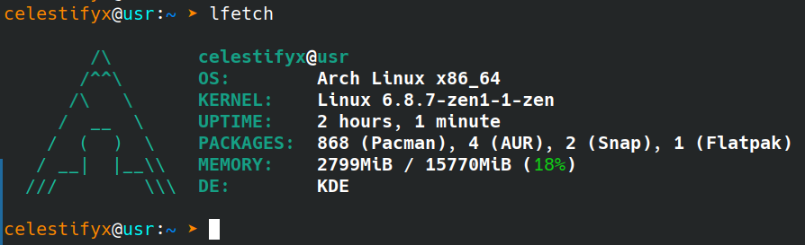

# LiberFetch

LiberFetch is a small system information tool designed for Unix-like operating systems written in Python.

## Installation

1. Clone the repository:
    ```bash
    git clone https://github.com/CelestifyX/LiberFetch.git
    ```

2. Navigate to the project directory:
    ```bash
    cd LiberFetch
    ```

3. Run `make install` to install LiberFetch:
    ```bash
    make install
    ```

## Usage

- Run `lfetch` to display system information.
- Customize the output using available options.

## Screenshots


